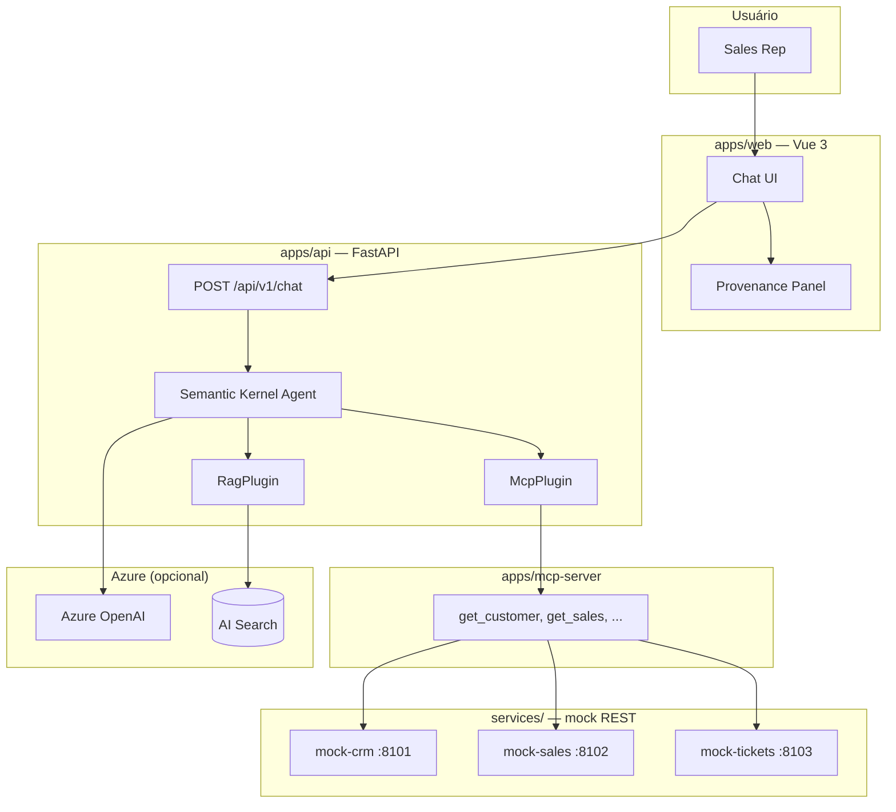
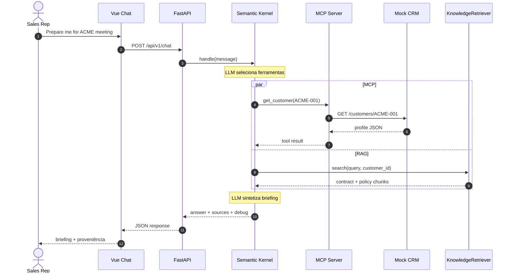

Times enterprise de vendas precisam de mais que um chatbot. Antes de uma reunião de renovação, um rep precisa puxar perfil CRM, tendência de receita, tickets abertos, datas de contrato e documentos de política — e então sintetizar um briefing acionável.

Este artigo percorre um POC de **Sales Intelligence Agent**: um monorepo que conecta **Semantic Kernel** a **ferramentas MCP** (APIs transacionais) e **RAG** (conhecimento documental), com UI de chat Vue e proveniência completa da requisição.

## O que você constrói

Um slice vertical que responde perguntas como *"Me prepare para a reunião com a ACME"*:

- **`apps/web`** — Chat Vue 3 com parsing FACT / RECOMMENDATION e sidebar de proveniência
- **`apps/api`** — FastAPI + agente Semantic Kernel com plugins MCP e RAG
- **`apps/mcp-server`** — Servidor MCP expondo CRM, vendas, tickets e contratos como ferramentas
- **`services/`** — APIs REST mock (CRM, vendas, tickets) para desenvolvimento local

O agente **escolhe** quais ferramentas chamar. Não hard-codeia um pipeline por pergunta.

## Arquitetura



### Regras por camada

| Camada | Responsabilidade | Não deve |
|-------|----------------|----------|
| HTTP (`api/`) | Validar request, serializar response | Conter lógica de agente |
| Agente (`agent/`) | Intenção, seleção de ferramentas, síntese | Chamar HTTP mock diretamente |
| Servidor MCP | Expor ferramentas, encaminhar para REST | Duplicar regras de negócio |
| RAG (`rag/`) | Embed, buscar, ranquear | Inventar conteúdo documental |

**MCP chama APIs REST existentes.** Lógica CRM fica no serviço mock CRM — não no agente nem na camada MCP.

## Fluxo da requisição

Um briefing executivo dispara chamadas MCP paralelas mais busca RAG, depois uma segunda passagem LLM para síntese.



## Agente Semantic Kernel

O orquestrador é uma fachada fina. Toda inteligência vive em `SemanticKernelSalesAgent`:

```python
# apps/api/app/agent/sk_agent.py
class SemanticKernelSalesAgent:
    def __init__(self, mcp_client, retriever, system_prompt: str = "") -> None:
        self.mcp_plugin = McpPlugin(mcp_client)
        self.rag_plugin = RagPlugin(retriever)
        self.kernel = self._build_kernel()
        self.agent = ChatCompletionAgent(
            kernel=self.kernel,
            name="SalesIntelligenceAgent",
            instructions=system_prompt,
            plugins=[self.mcp_plugin, self.rag_plugin],
            function_choice_behavior=FunctionChoiceBehavior.Auto(),
        )
```

`FunctionChoiceBehavior.Auto()` deixa o modelo decidir quais ferramentas `@kernel_function` invocar — sem tabela de roteamento manual em Python.

### Plugin MCP — dados transacionais

Cada kernel function encapsula uma chamada de ferramenta MCP e registra proveniência:

```python
# apps/api/app/agent/plugins/mcp_plugin.py
@kernel_function(
    name="get_customer",
    description="Fetch CRM profile for a customer ID (e.g. ACME-001)",
)
async def get_customer(self, customer_id: str) -> str:
    return await self._call("get_customer", {"customer_id": customer_id})
```

O plugin rastreia `tools_used` e `call_records` (argumentos, preview do resultado, duração) para o painel de debug.

### Plugin RAG — conhecimento documental

Políticas, contratos e fichas de produto vêm da retrieval — não da memória do modelo:

```python
# apps/api/app/agent/plugins/rag_plugin.py
@kernel_function(
    name="search_knowledge",
    description="Search policy, contract, and product documentation (RAG)",
)
async def search_knowledge(self, query: str, customer_id: str = "") -> str:
    hits = await self.retriever.search(query, customer_id=customer_id or None)
    self.sources.extend(SourceItem(**item) for item in hits)
    return json.dumps({"results": hits})
```

`KnowledgeRetriever` tenta Azure AI Search primeiro, depois cai para um store local em memória quando Azure não está configurado.

## Servidor MCP — ferramentas sobre REST

O servidor MCP não embute regras CRM. Expõe ferramentas tipadas que chamam endpoints HTTP:

```python
# apps/mcp-server/mcp_server/tools.py
@server.tool()
async def get_customer(customer_id: str) -> dict:
    """Fetch CRM profile for a customer by ID (e.g. ACME-001)."""
    async with httpx.AsyncClient() as client:
        return await _get(client, f"{settings.crm_api_url}/customers/{customer_id}")
```

| Ferramenta MCP | Chamada REST |
|----------|-----------|
| `get_customer` | `GET /customers/{id}` |
| `get_customer_sales` | `GET /customers/{id}/sales` |
| `get_customer_tickets` | `GET /customers/{id}/tickets` |
| `get_customer_contracts` | `GET /customers/{id}/contracts` |
| `search_products` | `GET /products?q=` |

Mesmo padrão adaptador de um servidor MCP Spring AI: **ferramentas semânticas por fora, REST por dentro.**

## FACT vs RECOMMENDATION

O system prompt impõe um formato rígido de resposta. Fatos devem vir de resultados de ferramenta ou RAG; recomendações são próximos passos inferidos pelo LLM:

```markdown
# ACME Corporation — Executive Briefing

## FACT
- Revenue trend: -12% YoY
- Open tickets: 3
- Contract renewal: 74 days

## RECOMMENDATION
1. Schedule executive check-in before renewal window.
2. Escalate open P1 tickets with support lead.
```

O frontend Vue parseia essa estrutura em uma sidebar de briefing para reps escanearem fatos separadamente das ações sugeridas.

## Proveniência — confie na resposta

Toda resposta inclui um payload `debug` construído a partir dos registros de chamada dos plugins:

```python
# apps/api/app/agent/provenance.py
def build_response_debug(*, mcp_plugin, rag_plugin, prompt_tokens, completion_tokens):
    pipeline = []
    for call in mcp_plugin.call_records:
        pipeline.append(f"mcp:{call.tool}")
    for call in rag_plugin.call_records:
        pipeline.append(f"rag:{call.tool}")
    pipeline.append("llm:synthesis")
    # ... steps with duration_ms, input/output summaries
```

A UI de chat renderiza isso como timeline passo a passo: quais ferramentas MCP rodaram, quais documentos foram recuperados, e uso de tokens na síntese. Essencial para demos e debug de risco de alucinação.

## Stack local

Execute o stack completo com Docker Compose:

```bash
docker compose up --build
```

| Serviço | Porta | Health |
|---------|------|--------|
| Vue | 5200 | Título homepage "Enterprise AI Sales Intelligence" |
| FastAPI | 8000 | `GET /health`, `GET /ready` |
| MCP Server | 8001 | Transporte Streamable HTTP |
| Mock CRM / Sales / Tickets | 8101–8103 | `GET /health` |

Azure OpenAI é obrigatório para chat (`AZURE_AI_ENDPOINT`, `AZURE_AI_API_KEY`, `AZURE_CHAT_DEPLOYMENT`). RAG sobe para Azure AI Search quando `AZURE_SEARCH_*` está configurado; senão o store local por keyword trata documentos demo em `data/`.

## Dataset demo — ACME Corporation

O POC traz dados fictícios porém relacionais para raciocínio do agente:

- **ACME-001** — receita em queda (-12%), renovação em 74 dias, 3 tickets abertos
- **GLOBEX-001** — conta mid-market em crescimento
- **INITECH-001** — renovação em 45 dias

Documentos (`contract-acme-2026.pdf`, política de renovação, política enterprise de IA) ficam em `data/` e alimentam o índice RAG após ingestão.

## Decisões de design principais

1. **Separar orquestração de HTTP** — controllers ficam finos; o agente dono da seleção de ferramentas.
2. **MCP para transações, RAG para documentos** — nunca peça ao LLM para lembrar números de CRM.
3. **Plugins, não chamadas inline** — `@kernel_function` do Semantic Kernel mantém MCP e RAG testáveis isoladamente.
4. **Proveniência por padrão** — toda chamada de ferramenta é logada com timing para UI e telemetria.
5. **Adoção Azure em fases** — Fase 1 prova Vue → Agente → MCP localmente; Search, Blob, Container Apps e Entra ID seguem sem reescrever o agente.

## O que experimentar a seguir

Pergunte ao agente:

- *"Quem é a ACME?"* — só MCP (`get_customer`)
- *"Qual nossa política de renovação para contas enterprise?"* — só RAG
- *"Me prepare para a reunião com a ACME"* — MCP + RAG + síntese

Observe o painel de proveniência para ver as escolhas de ferramentas do modelo em tempo real.

## Código-fonte

Monorepo completo: [`ms-poc`](https://github.com/farukzahra/ms-poc) — Python FastAPI, Semantic Kernel, MCP SDK, Vue 3, IaC Azure Bicep, e testes pytest + Playwright.
