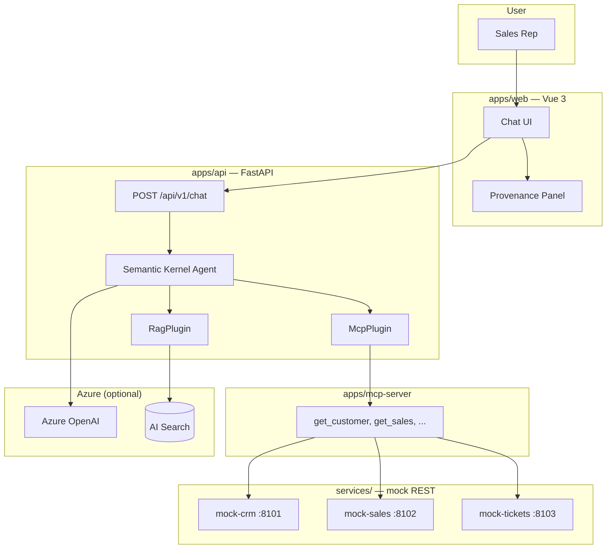
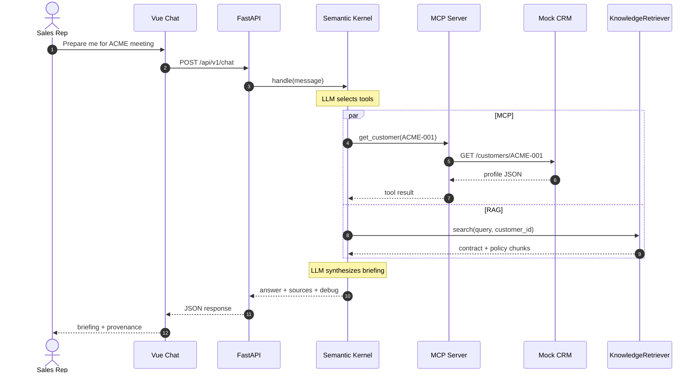

Enterprise sales teams need more than a chatbot. Before a renewal meeting, a rep must pull CRM profile, revenue trend, open tickets, contract dates, and policy documents—then synthesize an actionable briefing.

This article walks through a **Sales Intelligence Agent** POC: a monorepo that wires **Semantic Kernel** to **MCP tools** (transactional APIs) and **RAG** (document knowledge), with a Vue chat UI and full request provenance.

## What you build

A vertical slice that answers questions like *"Prepare me for my meeting with ACME"*:

- **`apps/web`** — Vue 3 chat with FACT / RECOMMENDATION parsing and a provenance sidebar
- **`apps/api`** — FastAPI + Semantic Kernel agent with MCP and RAG plugins
- **`apps/mcp-server`** — MCP server exposing CRM, sales, tickets, and contracts as tools
- **`services/`** — mock REST APIs (CRM, sales, tickets) for local development

The agent **chooses** which tools to call. It does not hard-code a pipeline per question.

## Architecture



### Layer rules

| Layer | Responsibility | Must not |
|-------|----------------|----------|
| HTTP (`api/`) | Validate request, serialize response | Contain agent logic |
| Agent (`agent/`) | Intent, tool selection, synthesis | Call mock HTTP directly |
| MCP server | Expose tools, forward to REST | Duplicate business rules |
| RAG (`rag/`) | Embed, search, rank | Invent document content |

**MCP calls existing REST APIs.** CRM logic stays in the mock CRM service—not in the agent or MCP layer.

## Request flow

An executive briefing triggers parallel MCP calls plus RAG search, then a second LLM pass for synthesis.



## Semantic Kernel agent

The orchestrator is a thin facade. All intelligence lives in `SemanticKernelSalesAgent`:

```python
# apps/api/app/agent/sk_agent.py
class SemanticKernelSalesAgent:
    def __init__(self, mcp_client, retriever, system_prompt: str = "") -> None:
        self.mcp_plugin = McpPlugin(mcp_client)
        self.rag_plugin = RagPlugin(retriever)
        self.kernel = self._build_kernel()
        self.agent = ChatCompletionAgent(
            kernel=self.kernel,
            name="SalesIntelligenceAgent",
            instructions=system_prompt,
            plugins=[self.mcp_plugin, self.rag_plugin],
            function_choice_behavior=FunctionChoiceBehavior.Auto(),
        )
```

`FunctionChoiceBehavior.Auto()` lets the model decide which `@kernel_function` tools to invoke—no manual routing table in Python.

### MCP plugin — transactional data

Each kernel function wraps one MCP tool call and records provenance:

```python
# apps/api/app/agent/plugins/mcp_plugin.py
@kernel_function(
    name="get_customer",
    description="Fetch CRM profile for a customer ID (e.g. ACME-001)",
)
async def get_customer(self, customer_id: str) -> str:
    return await self._call("get_customer", {"customer_id": customer_id})
```

The plugin tracks `tools_used` and `call_records` (arguments, result preview, duration) for the debug panel.

### RAG plugin — document knowledge

Policies, contracts, and product sheets come from retrieval—not from model memory:

```python
# apps/api/app/agent/plugins/rag_plugin.py
@kernel_function(
    name="search_knowledge",
    description="Search policy, contract, and product documentation (RAG)",
)
async def search_knowledge(self, query: str, customer_id: str = "") -> str:
    hits = await self.retriever.search(query, customer_id=customer_id or None)
    self.sources.extend(SourceItem(**item) for item in hits)
    return json.dumps({"results": hits})
```

`KnowledgeRetriever` tries Azure AI Search first, then falls back to a local in-memory store when Azure is not configured.

## MCP server — tools over REST

The MCP server does not embed CRM rules. It exposes typed tools that call HTTP endpoints:

```python
# apps/mcp-server/mcp_server/tools.py
@server.tool()
async def get_customer(customer_id: str) -> dict:
    """Fetch CRM profile for a customer by ID (e.g. ACME-001)."""
    async with httpx.AsyncClient() as client:
        return await _get(client, f"{settings.crm_api_url}/customers/{customer_id}")
```

| MCP tool | REST call |
|----------|-----------|
| `get_customer` | `GET /customers/{id}` |
| `get_customer_sales` | `GET /customers/{id}/sales` |
| `get_customer_tickets` | `GET /customers/{id}/tickets` |
| `get_customer_contracts` | `GET /customers/{id}/contracts` |
| `search_products` | `GET /products?q=` |

Same adapter pattern as a Spring AI MCP server: **semantic tools on the outside, REST on the inside.**

## FACT vs RECOMMENDATION

The system prompt enforces a strict response shape. Facts must come from tool or RAG results; recommendations are LLM-inferred next steps:

```markdown
# ACME Corporation — Executive Briefing

## FACT
- Revenue trend: -12% YoY
- Open tickets: 3
- Contract renewal: 74 days

## RECOMMENDATION
1. Schedule executive check-in before renewal window.
2. Escalate open P1 tickets with support lead.
```

The Vue frontend parses this structure into a briefing sidebar so reps can scan facts separately from suggested actions.

## Provenance — trust the answer

Every response includes a `debug` payload built from plugin call records:

```python
# apps/api/app/agent/provenance.py
def build_response_debug(*, mcp_plugin, rag_plugin, prompt_tokens, completion_tokens):
    pipeline = []
    for call in mcp_plugin.call_records:
        pipeline.append(f"mcp:{call.tool}")
    for call in rag_plugin.call_records:
        pipeline.append(f"rag:{call.tool}")
    pipeline.append("llm:synthesis")
    # ... steps with duration_ms, input/output summaries
```

The chat UI renders this as a step-by-step timeline: which MCP tools ran, which documents were retrieved, and token usage for synthesis. Essential for demos and debugging hallucination risk.

## Local stack

Run the full stack with Docker Compose:

```bash
docker compose up --build
```

| Service | Port | Health |
|---------|------|--------|
| Vue | 5200 | Homepage title "Enterprise AI Sales Intelligence" |
| FastAPI | 8000 | `GET /health`, `GET /ready` |
| MCP Server | 8001 | Streamable HTTP transport |
| Mock CRM / Sales / Tickets | 8101–8103 | `GET /health` |

Azure OpenAI is required for chat (`AZURE_AI_ENDPOINT`, `AZURE_AI_API_KEY`, `AZURE_CHAT_DEPLOYMENT`). RAG upgrades to Azure AI Search when `AZURE_SEARCH_*` is set; otherwise the local keyword store handles demo documents under `data/`.

## Demo dataset — ACME Corporation

The POC ships fictional but relational data for agent reasoning:

- **ACME-001** — declining revenue (-12%), renewal in 74 days, 3 open tickets
- **GLOBEX-001** — growing mid-market account
- **INITECH-001** — renewal in 45 days

Documents (`contract-acme-2026.pdf`, renewal policy, enterprise AI policy) live in `data/` and feed the RAG index after ingestion.

## Key design decisions

1. **Separate orchestration from HTTP** — controllers stay thin; the agent owns tool selection.
2. **MCP for transactions, RAG for documents** — never ask the LLM to remember CRM numbers.
3. **Plugins, not inline tool calls** — Semantic Kernel `@kernel_function` keeps MCP and RAG testable in isolation.
4. **Provenance by default** — every tool call is logged with timing for the UI and telemetry.
5. **Phased Azure adoption** — Phase 1 proves Vue → Agent → MCP locally; Search, Blob, Container Apps, and Entra ID follow without rewriting the agent.

## What to try next

Ask the agent:

- *"Who is ACME?"* — MCP only (`get_customer`)
- *"What is our renewal policy for enterprise accounts?"* — RAG only
- *"Prepare me for my meeting with ACME"* — MCP + RAG + synthesis

Watch the provenance panel to see the model's tool choices in real time.

## Source

Full monorepo: [`ms-poc`](https://github.com/farukzahra/ms-poc) — Python FastAPI, Semantic Kernel, MCP SDK, Vue 3, Azure Bicep IaC, and pytest + Playwright tests.
