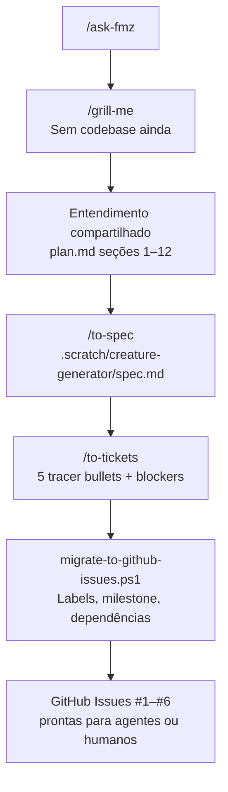

No [artigo anterior](/articles/agents/matt-pocock-skills-harness-product-crud-pt-br/), reconstruí um CRUD Java numa sessão e **pulei** `/to-spec` e `/to-tickets`. O grilling fechou o escopo; fomos direto para `/implement`.

Foi a escolha certa para uma revalidação. Seria a escolha errada para uma feature greenfield que atravessa várias sessões — exatamente o caso que queria testar em seguida.

Então criei o **[zoora](https://github.com/farukzahra/zoora)**: um gerador procedural de criaturas 3D (TypeScript, Vite, Three.js). A ideia do produto está em `plan.md`. **Ainda não há código de aplicação**. O que existe é um artefato de planejamento que dá para delegar: [seis issues abertas no GitHub](https://github.com/farukzahra/zoora/issues), um milestone, labels e dependências nativas entre tickets.

Este post é sobre essa camada de planejamento — não sobre a implementação Three.js.

## Por que o zoora existe

O **faruk-base2** me mostrou que skills roteiam comportamento, mas o *caminho* que você escolhe importa:

| Tipo de sessão | Caminho usado | Resultado |
|----------------|---------------|-----------|
| Revalidar exemplo existente | `/grill-with-docs` → `/implement` | 17 decisões, um commit, mesma sessão |
| Build greenfield multi-sessão | `/grill-me` → `/to-spec` → `/to-tickets` → GitHub | Spec + cadeia de tickets, zero linhas de app |

O zoora é a segunda linha. A promessa central do `plan.md`:

> **Um seed gera uma criatura determinística e visualmente única.**

A arquitetura está fixada antes de qualquer ticket rodar:

```text
SEED → PRNG → CreatureGenerator → CreatureDefinition → GeometryBuilder → Three.js
```

`CreatureDefinition` é dado puro — sem tipos Three.js. Essa separação está na spec, ainda não no código.

## O workflow que rodei de fato

Mesmo harness do faruk-base2 ([skills do Matt Pocock](https://github.com/mattpocock/skills), router local `/ask-fmz`). Ramo diferente do diagrama:



**`/grill-me`** em vez de `/grill-with-docs` — não havia repo para ler, só uma ideia. A entrevista fixou stack (TypeScript, Vite, Three.js r160+), regras de determinismo (sem `Math.random()` na geração), escopo de testes (Vitest na camada de dados) e itens explicitamente fora de escopo (mecânicas de jogo, backend, imports GLTF).

**`/to-spec`** sintetizou a conversa num PRD em `.scratch/creature-generator/spec.md`: problem statement, user stories, decisões de implementação, decisões de teste, lista out-of-scope.

**`/to-tickets`** quebrou a Fase 1 em cinco fatias end-to-end — cada ticket entrega comportamento observável, não uma camada horizontal:

| Ticket | Título | Bloqueado por |
|--------|--------|---------------|
| #2 | Scaffold Vite + Three.js + UI shell | — |
| #3 | PRNG and SeedGenerator | #2 |
| #4 | CreatureDefinition + CreatureGenerator | #3 |
| #5 | GeometryBuilder + MaterialGenerator | #4 |
| #6 | UI Generate, Randomize, copy seed | #5 |

Depois, um script one-time (`scripts/migrate-to-github-issues.ps1`) publicou tudo no GitHub: labels, milestone, issues, dependências nativas `blocked_by` e um Project board.

## O que foi parar no GitHub


Abra o board: [github.com/farukzahra/zoora/issues](https://github.com/farukzahra/zoora/issues)

### Issue #1 — a spec

A **[#1 [Spec] Phase 1 - Procedural Creature Generator](https://github.com/farukzahra/zoora/issues/1)** é o PRD pai. Labels: `type:spec`, `ready-for-agent`, `phase:1`, `feature:creature-generator`. O corpo liga as tasks filhas (#2–#6) e aponta para o arquivo de spec completo no repo.

Cada ticket de implementação começa com `Part of #1` — agentes e humanos sabem onde estão os critérios de aceite.

### Issues #2–#6 — tracer bullets

Cada issue de task carrega o mesmo conjunto de labels, trocando `type:task`:

- **#2** está desbloqueada — único ticket que pode começar hoje.
- **#3–#6** exibem o badge nativo **Blocked** do GitHub via API de dependências, mais a linha `Blocked by: #N` no corpo como fallback.

A cadeia é intencional. O ticket #3 (PRNG) não espera a UI completa; espera um shell Vite que rode Vitest. O #6 (UI) espera geometria — não dá para demonstrar Generate/Randomize sem meshes.

### Milestone e project

As seis issues ficam no milestone **Phase 1 - Basic Generator** (`Seed → CreatureDefinition determinístico → protótipo Three.js`). Um GitHub Project agrupa tudo para tracking estilo kanban: [Project #2](https://github.com/users/farukzahra/projects/2).

## O sistema de labels

Labels são o contrato entre quem planeja, quem implementa e quem faz triagem. Labels customizadas criadas para o zoora:

| Label | Cor | Significado |
|-------|-----|-------------|
| `type:spec` | roxo | PRD / especificação — não implementável diretamente |
| `type:task` | azul | Item de implementação |
| `ready-for-agent` | verde | Totalmente especificado; seguro para agente autônomo |
| `ready-for-human` | amarelo | Precisa de julgamento humano (não usado nos tickets da Fase 1) |
| `needs-triage` | rosa | Maintainer precisa avaliar antes de começar |
| `needs-info` | azul | Aguardando input de quem reportou |
| `phase:1` | azul | Fatia do milestone — só gerador básico |
| `feature:creature-generator` | teal | Tag de área do produto para filtrar |
| `wayfinder:map` | azul claro | Reservada para mapas de decisão do `/wayfinder` (futuro) |

Labels de workflow (`ready-for-agent` vs `needs-triage`) permitem filtrar com:

```bash
gh issue list --state open --label ready-for-agent
```

Templates em `.github/ISSUE_TEMPLATE/` (`spec.yml`, `task.yml`) pré-preenchem labels para issues criadas manualmente.

## Delegando para agentes ou pessoas

O objetivo de parar nas issues — sem implementar — é a **superfície de handoff**.

### Para outro agente Cursor

1. Abrir o zoora, ler `AGENTS.md` e `docs/agents/issue-tracker.md`.
2. Pegar a task `ready-for-agent` desbloqueada mais antiga: **#2**.
3. Rodar `/implement` contra essa issue (a skill puxa critérios de aceite da spec linkada e dos arquivos scratch).
4. Abrir PR referenciando `Closes #2`, rodar CI, merge.
5. #3 desbloqueia automaticamente quando a dependência resolve.

Cada ticket é dimensionado para uma **sessão nova** — o harness do Matt assume contexto fresco por issue, não um mega-prompt para os cinco.

### Para um contribuidor humano

Mesmo filtro: `gh issue list --label ready-for-agent --label type:task`. Claim com `gh issue edit 2 --add-assignee @me`. A spec (#1) e os arquivos scratch locais (`.scratch/creature-generator/issues/01-scaffold-vite-three.md`) têm o checklist detalhado que o corpo da issue resume.

### Para que `/triage` *não* serve

A documentação das skills é explícita: **`/triage` é para issues que você não criou**. Tickets do `/to-tickets` já passaram pelo grilling — pulam triagem e chegam como `ready-for-agent`.

## Scratch local vs GitHub como fonte de verdade

Durante o planejamento, os artefatos ficaram em `.scratch/creature-generator/`:

```
.scratch/creature-generator/
├── spec.md
└── issues/
    ├── 01-scaffold-vite-three.md
    ├── 02-prng-seed-generator.md
    └── ...
```

Após a migração, **GitHub Issues são canônicas** para trabalho novo. Os arquivos scratch permanecem como detalhe rico (checklists de aceite, requisitos Vitest); as issues linkam de volta. `docs/agents/issue-tracker.md` documenta convenções de API, criação de dependências e operações wayfinder.

Exemplo do ticket local — detalhe que cabe na spec mas não no título da issue:

> **What to build:** SeedGenerator que normaliza seed (string ou número) em PRNG determinístico. `random()`, `randomRange()` e `randomInt()` reproduzíveis. Vitest prova sequência estável e que `Math.random()` não é usado na API pública.

O corpo da issue no GitHub fica curto; o arquivo scratch guarda o checklist.

## O que deliberadamente não fiz

- **Sem /implement ainda** — este artigo para no backlog.
- **Sem prototype** — `/prototype` é para spikes descartáveis quando você precisa *ver* algo antes de specar. Aqui, o `plan.md` já tinha estrutura suficiente para o grilling.
- **Sem código no repo do blog** — zoora é repo externo, linkado no texto (mesmo padrão do faruk-base2).

Próximo passo quando eu (ou alguém) pegar isso: `/implement` no #2, validar `npm run dev`, merge, ver #3 desbloquear.

## O que tiro daqui

**A nota de rodapé do artigo anterior era o roadmap.** "Para um build multi-dia com arestas de bloqueio, eu pegaria o caminho longo." O zoora é esse caminho, documentado de ponta a ponta.

**Issues são a API entre sessões.** Grilling captura intenção; `/to-spec` congela; `/to-tickets` corta fatias verticais; GitHub adiciona visibilidade, dependências e filtros. Um agente sem histórico de chat pode começar só pela issue #2.

**Labels são roteamento barato.** `ready-for-agent` não é vaidade — é o sinal de que grilling e spec acabaram, e trabalho autônomo não vai adivinhar requisitos faltantes.

**Planejamento é entregável.** Seis issues, zero código de app, e o projeto já é legível para outra pessoa ou agente. Esse é o resultado que queria mostrar.

---

*Repo: [zoora](https://github.com/farukzahra/zoora). Issues: [#1–#6](https://github.com/farukzahra/zoora/issues). Harness de skills: [faruk-base2](https://github.com/farukzahra/faruk-base2) / [mattpocock/skills](https://github.com/mattpocock/skills). Sessão anterior: [Testei as Agent Skills do Matt Pocock](/articles/agents/matt-pocock-skills-harness-product-crud-pt-br/).*
