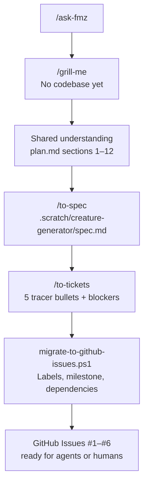

In the [previous article](/articles/agents/matt-pocock-skills-harness-product-crud/), I rebuilt a Java CRUD in one session and **skipped** `/to-spec` and `/to-tickets`. Grilling closed the scope; we went straight to `/implement`.

That was the right call for a revalidation. It would be the wrong call for a greenfield feature that spans multiple sessions — exactly the case I wanted to test next.

So I started **[zoora](https://github.com/farukzahra/zoora)**: a procedural 3D creature generator (TypeScript, Vite, Three.js). The product idea lives in `plan.md`. There is **no application code yet**. What exists is a planning artifact you can delegate: [six open GitHub issues](https://github.com/farukzahra/zoora/issues), a milestone, labels, and native dependency edges between tickets.

This post is about that planning layer — not the Three.js implementation.

## Why zoora exists

**faruk-base2** taught me that skills route behavior, but the *path* you pick matters:

| Session type | Path I used | Outcome |
|--------------|-------------|---------|
| Revalidate existing example | `/grill-with-docs` → `/implement` | 17 decisions, one commit, same session |
| Greenfield multi-session build | `/grill-me` → `/to-spec` → `/to-tickets` → GitHub | Spec + ticket chain, zero lines of app code |

Zoora is the second row. The core promise from `plan.md`:

> **One seed produces a deterministic, visually unique creature.**

Architecture is fixed before any ticket runs:

```text
SEED → PRNG → CreatureGenerator → CreatureDefinition → GeometryBuilder → Three.js
```

`CreatureDefinition` is pure data — no Three.js types. That separation is in the spec, not in code yet.

## The workflow I actually ran

Same harness as faruk-base2 ([Matt Pocock's skills](https://github.com/mattpocock/skills), local router `/ask-fmz`). Different branch of the diagram:



**`/grill-me`** instead of `/grill-with-docs` — there was no repo to read, only an idea. The interview locked stack (TypeScript, Vite, Three.js r160+), determinism rules (no `Math.random()` in generation), test scope (Vitest on the data layer), and explicit out-of-scope items (game mechanics, backend, GLTF imports).

**`/to-spec`** synthesized the conversation into a PRD under `.scratch/creature-generator/spec.md`: problem statement, user stories, implementation decisions, testing decisions, out-of-scope list.

**`/to-tickets`** broke Phase 1 into five end-to-end slices — each ticket delivers observable behavior, not a horizontal layer:

| Ticket | Title | Blocked by |
|--------|-------|------------|
| #2 | Scaffold Vite + Three.js + UI shell | — |
| #3 | PRNG and SeedGenerator | #2 |
| #4 | CreatureDefinition + CreatureGenerator | #3 |
| #5 | GeometryBuilder + MaterialGenerator | #4 |
| #6 | UI Generate, Randomize, copy seed | #5 |

Then a one-time script (`scripts/migrate-to-github-issues.ps1`) published everything to GitHub: labels, milestone, issues, native `blocked_by` dependencies, and a Project board.

## What landed on GitHub


Open the board: [github.com/farukzahra/zoora/issues](https://github.com/farukzahra/zoora/issues)

### Issue #1 — the spec

**[#1 [Spec] Phase 1 - Procedural Creature Generator](https://github.com/farukzahra/zoora/issues/1)** is the parent PRD. Labels: `type:spec`, `ready-for-agent`, `phase:1`, `feature:creature-generator`. Its body links child tasks (#2–#6) and points to the full spec file in the repo.

Every implementation ticket starts with `Part of #1` — agents and humans know where acceptance criteria live.

### Issues #2–#6 — tracer bullets

Each task issue carries the same label set except `type:task`:

- **#2** is unblocked — the only ticket that can start today.
- **#3–#6** show GitHub's native **Blocked** badge via issue dependencies API, plus a `Blocked by: #N` line in the body as fallback.

That chain is deliberate. Ticket #3 (PRNG) does not wait for the full UI; it waits for a Vite shell that can run Vitest. Ticket #6 (UI wiring) waits for geometry — you cannot demo Generate/Randomize without meshes.

### Milestone and project

All six issues sit in milestone **Phase 1 - Basic Generator** (`Seed → deterministic CreatureDefinition → Three.js prototype`). A GitHub Project board groups them for kanban-style tracking: [Project #2](https://github.com/users/farukzahra/projects/2).

## The label system

Labels are the contract between planner, implementer, and triage. Custom labels created for zoora:

| Label | Color | Meaning |
|-------|-------|---------|
| `type:spec` | purple | PRD / specification — not directly implementable |
| `type:task` | blue | Implementation work item |
| `ready-for-agent` | green | Fully specified; safe for an autonomous agent |
| `ready-for-human` | yellow | Needs human judgment (not used on Phase 1 tickets) |
| `needs-triage` | pink | Maintainer must evaluate before work starts |
| `needs-info` | blue | Waiting on reporter input |
| `phase:1` | blue | Milestone slice — basic generator only |
| `feature:creature-generator` | teal | Product area tag for filtering |
| `wayfinder:map` | light blue | Reserved for `/wayfinder` decision maps (future) |

Workflow labels (`ready-for-agent` vs `needs-triage`) let you filter with:

```bash
gh issue list --state open --label ready-for-agent
```

Issue templates under `.github/ISSUE_TEMPLATE/` (`spec.yml`, `task.yml`) pre-fill label sets for manually created issues.

## Delegating to agents or people

The point of stopping at issues — without implementing — is **handoff surface**.

### For another Cursor agent

1. Open zoora, read `AGENTS.md` and `docs/agents/issue-tracker.md`.
2. Pick the oldest unblocked `ready-for-agent` task: **#2**.
3. Run `/implement` against that issue (the skill pulls acceptance criteria from the linked spec and scratch files).
4. Open a PR referencing `Closes #2`, run CI, merge.
5. #3 unblocks automatically when the dependency resolves.

Each ticket is scoped for a **fresh session** — Matt's harness assumes new context per issue, not one mega-prompt for all five.

### For a human contributor

Same filter: `gh issue list --label ready-for-agent --label type:task`. Claim with `gh issue edit 2 --add-assignee @me`. The spec (#1) and local scratch files (`.scratch/creature-generator/issues/01-scaffold-vite-three.md`) hold the detailed acceptance checklist the GitHub body summarizes.

### What `/triage` is *not* for

Skills docs are explicit: **`/triage` is for issues you did not create**. Tickets from `/to-tickets` already went through grilling — they skip triage and land as `ready-for-agent`.

## Local scratch vs GitHub as source of truth

During planning, artifacts lived in `.scratch/creature-generator/`:

```
.scratch/creature-generator/
├── spec.md
└── issues/
    ├── 01-scaffold-vite-three.md
    ├── 02-prng-seed-generator.md
    └── ...
```

After migration, **GitHub Issues are canonical** for new work. The scratch files remain as rich detail (acceptance checklists, Vitest requirements); the issues link back to them. `docs/agents/issue-tracker.md` documents API conventions, dependency creation, and wayfinder operations.

Example from the local ticket file — detail that fits a spec but not a GitHub title:

> **What to build:** SeedGenerator that normalizes seed (string or number) into a deterministic PRNG. `random()`, `randomRange()`, and `randomInt()` must be reproducible. Vitest proves a stable sequence and that `Math.random()` is not used in the public API.

The GitHub issue body stays short; the scratch file holds the checklist.

## What I deliberately did not do

- **No /implement yet** — this article stops at the backlog.
- **No prototype** — `/prototype` is for throwaway spikes when you need to *see* something before specing. Here, `plan.md` already had enough structure for grilling.
- **No code in the blog repo** — zoora is an external repo, linked in prose (same pattern as faruk-base2).

Next step when I (or someone else) picks this up: `/implement` on #2, validate `npm run dev`, merge, watch #3 unblock.

## What I take from this

**The previous article's footnote was the roadmap.** "For a multi-day build with blocking edges, I would take the longer path." Zoora is that path, documented end-to-end.

**Issues are the API between sessions.** Grilling captures intent; `/to-spec` freezes it; `/to-tickets` cuts vertical slices; GitHub adds visibility, dependencies, and filters. An agent without chat history can start from issue #2 alone.

**Labels are cheap routing.** `ready-for-agent` is not vanity — it is the signal that grilling and spec work are done, and autonomous work will not guess missing requirements.

**Planning is shippable.** Six issues, zero app code, and the project is already legible to another person or agent. That is the outcome I wanted to show.

---

*Repo: [zoora](https://github.com/farukzahra/zoora). Issues: [#1–#6](https://github.com/farukzahra/zoora/issues). Skills harness: [faruk-base2](https://github.com/farukzahra/faruk-base2) / [mattpocock/skills](https://github.com/mattpocock/skills). Previous session: [I Tested Matt Pocock's Agent Skills](/articles/agents/matt-pocock-skills-harness-product-crud/).*
