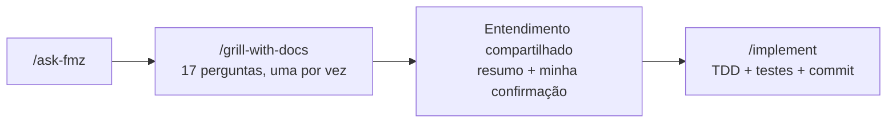
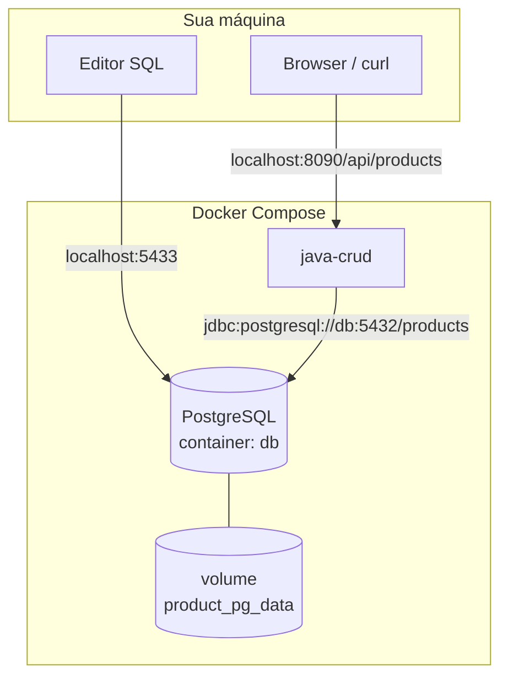

Testei as [agent skills do Matt Pocock](https://github.com/mattpocock/skills) em um refactor real. Isto é o que saiu — não uma demo polida, mas uma conversa com um LLM e o código que ele produziu depois.

A versão curta: na primeira tentativa, pedi um CRUD e o agente pulou arquitetura. Na segunda, disse *"pergunte tudo de novo"* e obtive 17 decisões explícitas antes de mudar uma linha.

## Por que o repositório se chama faruk-base2

**faruk-base** (o primeiro repo) foi eu escolhendo skills uma a uma — instalar isso, testar aquilo, montar meu próprio workflow na mão. Funcionou o suficiente para aprender a mecânica, mas não havia um harness coerente: sem router, sem protocolo de grilling, sem cadeia spec/ticket quando as coisas ficavam grandes.

**faruk-base2** é a aposta oposta. Clonei um template construído em torno das [engineering skills do Matt Pocock](https://github.com/mattpocock/skills) — alguém com mais experiência que eu curando *quais* skills existem e *como* elas encadeiam. Instale com `npx skills add mattpocock/skills`, restaure de `skills-lock.json`, leia `HELP-SKILLS.md`.

Renomeei o router de entrada localmente de `/ask-matt` para **`/ask-fmz`**. Mesmo conteúdo de skill, nome de invocação diferente em `.agents/skills/`, `.claude/skills/` e `agent/skills/`. Quando vir `/ask-fmz` abaixo, leia [mattpocock/skills](https://github.com/mattpocock/skills).

O repositório é um testbed de skills. Esta sessão focou em **`examples/java-crud`** — uma API REST de Product em Java 21, Spring Boot 4.1 e PostgreSQL no Docker:

| Item | Valor |
|------|-------|
| API | `http://localhost:8090/api/products` |
| Stack | Java 21, Spring Boot 4.1, PostgreSQL 17 |
| Editor SQL (host) | `localhost:5433` |

Cada exemplo tem `CONTEXT.md` e ADRs em `docs/adr/`. Regra do workspace: **decisões técnicas só após minha confirmação, uma de cada vez.**

## Tentativa um: "faça um CRUD" — e o agente pulou arquitetura

Antes da sessão documentada aqui, pedi ao agente — usando as skills do Matt — para construir um CRUD. Rodou. Código apareceu. Docker subiu.

O que ele **não** fez: me guiar pela arquitetura. Sem pergunta de design em camadas. Sem estratégia de schema. Sem momento "onde fica o banco?". Assumiu defaults e seguiu.

Esse é o modo de falha que me importa. Um LLM com skills ainda é um LLM: se o prompt é vago e a cadeia de skills não força uma entrevista, você ganha *um* CRUD, não *o seu* CRUD.

Então abri um novo thread e anexei `/ask-fmz` com uma instrução mais clara:

> *Reconstrua o módulo Java e pergunte tudo de novo.*

## Tentativa dois: o fluxo que realmente usamos



**Não** usamos `/to-spec`, `/to-tickets`, `/handoff`, `/prototype`, nem um `/code-review` formal com sub-agentes paralelos. O escopo já estava fechado após o grilling — mesma sessão, direto para `/implement`.

O harness completo do Matt suporta um caminho mais longo (`/to-spec` → `/to-tickets` → `/implement` por ticket). Isso é para builds multi-sessão. Aqui foi revalidação de um exemplo existente, não feature greenfield.

## A conversa, turno a turno

Abaixo está o arco da sessão — não cada palavra, mas as decisões como aconteceram.

### Turnos 1–4 — Baseline de stack

**Eu:** `/ask-fmz reconstrua o módulo Java e pergunte tudo de novo`

**Agente:** Leu o `java-crud` atual (Spring Boot 4.1, Java 21, PostgreSQL, H2 nos testes, `ddl-auto`, Swagger sempre ligado). Iniciou `/grill-with-docs`.

| Turno | Pergunta | Minha resposta |
|------|----------|-----------|
| 1 | Objetivo do refactor | **A** — mesmo CRUD de Product, revalidar stack e decisões |
| 2 | Versão Java | **A** — Java 21 |
| 3 | Spring Boot | **A** — 4.x |
| 4 | Banco em runtime | *(ver turno 5)* |

### Turno 5 — "Onde vai ficar esse banco?"

A pergunta 4 era escolher o banco de runtime. Antes de escolher, interrompi:

> *Me diga onde esse banco vai ficar?*

Não queria um checkbox "PostgreSQL". Queria uma imagem do que cai na minha máquina quando rodo `docker compose up`.

**Agente:** Em vez de assumir, leu `docker-compose.yml` e respondeu com um diagrama — depois refez a pergunta 4 com uma tabela mapeando cada opção para portas e containers:



Esse foi o momento em que o grilling fez sentido. O agente não decidiu — eu ainda escolhi **PostgreSQL no Docker** (opção A). Mas pude ver o porquê: nada instala Postgres nativo no Windows; dados sobrevivem reinícios em volume nomeado; meu editor usa **5433**, a API **8090**, e o app fala com `db:5432` na rede interna.

### Turno 6 — Um requisito nascido no chat

Depois de entender o layout, respondi — e acrescentei algo que o checklist nunca perguntou:

> *A, mas preciso sempre saber como acessar esse banco no meu editor SQL.*

Essa frase virou uma **seção do README** — "Database access (SQL editor)" (`Acesso ao banco (editor SQL)` no repo; docs ficam pt-BR) com host, porta, user e senha para copiar e colar. Não é código. Ainda faz parte do entregável.

| Turno | Tópico | Minha resposta |
|------|-------|-----------|
| 5 | Banco de teste | **A** — H2 em memória (profile `test`) |
| 6 | Ferramenta de schema | **C** — **Liquibase** (substituindo `ddl-auto: update`) |
| 7 | Swagger | **B** — só no profile dev |
| 8 | Portas no host | **A** — API **8090**, Postgres **5433** |

### Turnos 11–17 — Arquitetura, testes, idioma

| Turno | Tópico | Minha resposta |
|------|-------|-----------|
| 9 | Regras de validação | **A** — manter atual (nome max 120, price ≥ 0.01, etc.) |
| 10 | Camadas | **A** — Controller → Service → Repository + DTOs + exception handler |
| 11 | Build Docker | **A** — `mvn test` depois `mvn package` no Dockerfile |
| 12 | Profile default do compose | **A** — `dev` (Swagger ligado no `docker compose up`) |
| 13 | Liquibase nos testes H2 | **A** — mesmo changelog da produção |
| 14 | Formato de erro HTTP | **B** — `{ "error": "..." }` em **inglês** |
| 15 | Escopo de teste de integração | **B** — *"sempre testar mais coisas para não ter bugs"* |
| 16 | Ordenação da listagem | **B** — `createdAt DESC` |
| 17 | Idioma docs vs código | Docs **pt-BR**; código, testes, mensagens HTTP, labels Swagger, commits **inglês** |

Após o turno 17, o agente mostrou uma tabela consolidada das 17 decisões mais um diagrama antes/depois. Respondi com **`/implement`**.

## O que mudou no módulo

| Antes | Depois |
|--------|-------|
| `ddl-auto: update` | Liquibase + `ddl-auto: validate` |
| Swagger sempre ligado | Swagger só em `dev`; desligado em `prod` |
| Erros em português (`Produto não encontrado`) | Inglês (`Product not found`) |
| Ordem da listagem indefinida | `findAllByOrderByCreatedAtDesc()` |
| 4 testes de integração | **9** testes de integração |
| README sem bloco de acesso SQL | Seção dedicada para editor SQL |

## Depois do `/implement`

O agente commitou **`90526d2`** — `refactor(java-crud): revalidate example with Liquibase and expanded tests`. O diff bate com a tabela acima: schema tooling, profiles Swagger, erros em inglês, ordenação da listagem, testes e README.

Vale mostrar só um trecho — a precondition Liquibase para volumes Docker legados. O setup antigo usava `ddl-auto: update`; meu volume ainda tinha tabela `products` mas sem linha em `DATABASECHANGELOG`. O primeiro boot após o refactor falhou com `relation "products" already exists`. Isto resolveu:

```yaml
# db.changelog-master.yaml
preConditions:
  - onFail: MARK_RAN
  - not:
      tableExists:
        tableName: products
```

O resto foi estrutural: `ProductRepository.findAllByOrderByCreatedAtDesc()`, `@Profile("dev")` no OpenAPI, nove casos em `ProductCrudIntegrationTest`, e três ADRs novos em `docs/adr/`.

## Como validamos

```bash
cd examples/java-crud
docker compose --profile test run --rm test   # 9/9
docker compose up --build -d
curl http://localhost:8090/actuator/health
curl http://localhost:8090/api/products/9999  # {"error":"Product not found"}
```

Swagger UI retornou **200** no profile `dev` default. Editor SQL: `jdbc:postgresql://localhost:5433/products` (user/pass `products`).

## O que eu tiro disso

**O prompt é o produto.** Mesmas skills, duas sessões, resultados opostos. "Faça um CRUD" deixou o agente pular arquitetura. *"Pergunte tudo de novo"* forçou `/grill-with-docs` a rodar como desenhado — 17 perguntas, uma por turno, cada uma com opções e recomendação. Skills roteiam comportamento; não consertam um pedido vago.

**Conversa é canal de requisitos.** O requisito do editor SQL não estava em nenhum ADR até eu digitar no meio do grill. Virou seção de README com JDBC para copiar e colar. Os melhores specs às vezes chegam como comentário lateral, não como ticket.

**Fatos e decisões ficam separados.** Quando perguntei onde o banco ficaria, o agente leu `docker-compose.yml` e explicou containers, volumes e portas. Eu ainda tive que escolher PostgreSQL em vez de H2. Esse é o ritmo que quero: o agente mostra o que é verdade no repo; eu fico com a escolha.

**Versionamento expõe dívida real.** Migrar de `ddl-auto` para Liquibase quebrou startup em volume Docker antigo — tabela existia sem linha em `DATABASECHANGELOG`. Defaults amigáveis para demo escondem isso até você commitar com migrations. A precondition no changelog não foi teórica; desbloqueou o deploy.

**Uma sessão bastou aqui.** Pulamos `/to-spec` e `/to-tickets` porque o grilling fechou o escopo. Para um build de vários dias com dependências bloqueantes entre tickets, eu pegaria o caminho longo. O harness oferece os dois; escolher o caminho curto também é decisão.

---

*Repo: [faruk-base2](https://github.com/farukzahra/faruk-base2). Skills upstream: [mattpocock/skills](https://github.com/mattpocock/skills). Router local: `/ask-fmz`. Handoff completo da sessão: `resumo.md` no repo.*
