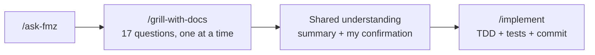

I tested [Matt Pocock's agent skills](https://github.com/mattpocock/skills) on a real refactor. This is what came out—not a polished demo, but a conversation with an LLM and the code it produced afterward.

The short version: first attempt, I asked for a CRUD and the agent skipped architecture. Second attempt, I said *"ask everything again"* and got 17 explicit decisions before a single line changed.

## Why the repo is called faruk-base2

**faruk-base** (the first repo) was me picking skills one by one—install this, try that, wire my own workflow by hand. It worked well enough to learn the mechanics, but there was no coherent harness: no router, no grilling protocol, no spec/ticket chain when things got big.

**faruk-base2** is the opposite bet. I cloned a template built around [Matt Pocock's engineering skills](https://github.com/mattpocock/skills)—someone with more experience than me curating *which* skills exist and *how* they chain. Install with `npx skills add mattpocock/skills`, restore from `skills-lock.json`, read `HELP-SKILLS.md`.

I renamed the entry router locally from `/ask-matt` to **`/ask-fmz`**. Same skill content, different invocation name in `.agents/skills/`, `.claude/skills/`, and `agent/skills/`. When you see `/ask-fmz` below, read [mattpocock/skills](https://github.com/mattpocock/skills).

The repo holds three Product CRUD stacks that share `/api/products`:

| Example | Stack | Port |
|---------|-------|------|
| `java-crud` | Java 21, Spring Boot 4.1, PostgreSQL | **8090** |
| `fastapi-crud` | Python 3.12, FastAPI | **8091** |
| `vue-crud` | Vue 3, Vuetify, Pinia | **5195** |

Each example has `CONTEXT.md` and ADRs under `docs/adr/`. The workspace rule: **technical decisions only after my confirmation, one at a time.**

## Attempt one: "make a CRUD" — and the agent skipped architecture

Before the session documented here, I asked the agent—using Matt's skills—to build a CRUD. It ran. Code appeared. Docker came up.

What it did **not** do: walk me through architecture. No layered design question. No schema strategy. No "where does the database live?" moment. It assumed defaults and moved on.

That is the failure mode I care about. An LLM with skills is still an LLM: if the prompt is vague and the skill chain does not force an interview, you get *a* CRUD, not *your* CRUD.

So I opened a new thread and attached `/ask-fmz` with a clearer instruction:

> *Rebuild the Java module and ask everything again.*

## Attempt two: the flow we actually used



We did **not** use `/to-spec`, `/to-tickets`, `/handoff`, `/prototype`, or a formal `/code-review` with parallel sub-agents. Scope was already closed after grilling—same session, straight to `/implement`.

Matt's full harness supports a longer path (`/to-spec` → `/to-tickets` → per-ticket `/implement`). That is for multi-session builds. This was a revalidation of an existing example, not a greenfield feature.

## The conversation, turn by turn

Below is the session arc—not every word, but the decisions as they happened.

### Turns 1–4 — Stack baseline

**Me:** `/ask-fmz rebuild the Java module and ask everything again`

**Agent:** Read the current `java-crud` (Spring Boot 4.1, Java 21, PostgreSQL, H2 in tests, `ddl-auto`, Swagger always on). Started `/grill-with-docs`.

| Turn | Question | My answer |
|------|----------|-----------|
| 1 | Refactor goal | **A** — same Product CRUD, revalidate stack and decisions |
| 2 | Java version | **A** — Java 21 |
| 3 | Spring Boot | **A** — 4.x |
| 4 | Runtime database | *(see turn 5)* |

### Turn 5 — "Where will this database live?"

I stopped the flow:

> *Tell me where this database will live?*

Fair question. I did not want an abstract "PostgreSQL" checkbox—I wanted to know what I would see on my machine.

**Agent:** Answered from `docker-compose.yml` before re-asking:

- PostgreSQL runs in a **Docker container** (`db`), not a native Windows install
- Data persists in volume `product_pg_data`
- App connects internally: `jdbc:postgresql://db:5432/products`
- **My SQL editor:** `localhost:5433` (host port mapped to container 5432)
- API: `localhost:8090`

Facts from the repo. The choice was still mine.

### Turn 6 — A requirement born in chat

> *A, but I always need to know how to access this database from my SQL editor.*

That sentence became a **README section**—"Database access (SQL editor)" (`Acesso ao banco (editor SQL)` in the repo; docs stay pt-BR) with copy-paste host, port, user, password. Not code. Still part of the deliverable.

| Turn | Topic | My answer |
|------|-------|-----------|
| 5 | Test database | **A** — H2 in memory (`test` profile) |
| 6 | Schema tooling | **C** — **Liquibase** (replacing `ddl-auto: update`) |
| 7 | Swagger | **B** — dev profile only |
| 8 | Host ports | **A** — API **8090**, Postgres **5433** |

### Turns 11–17 — Architecture, tests, language

| Turn | Topic | My answer |
|------|-------|-----------|
| 9 | Validation rules | **A** — keep current (name max 120, price ≥ 0.01, etc.) |
| 10 | Layers | **A** — Controller → Service → Repository + DTOs + exception handler |
| 11 | Docker build | **A** — `mvn test` then `mvn package` in Dockerfile |
| 12 | Default compose profile | **A** — `dev` (Swagger on at `docker compose up`) |
| 13 | Liquibase in H2 tests | **A** — same changelog as production |
| 14 | HTTP error format | **B** — `{ "error": "..." }` in **English** |
| 15 | Integration test scope | **B** — *"always test more things so we don't have bugs"* |
| 16 | List ordering | **B** — `createdAt DESC` |
| 17 | Docs vs code language | Docs **pt-BR**; code, tests, HTTP messages, Swagger labels, commits **English** |

After turn 17, the agent showed a consolidated table of all 17 decisions plus a before/after diagram. I replied with **`/implement`**.

## What changed in the module

| Before | After |
|--------|-------|
| `ddl-auto: update` | Liquibase + `ddl-auto: validate` |
| Swagger always on | Swagger only in `dev`; off in `prod` |
| Errors in Portuguese (`Produto não encontrado`) | English (`Product not found`) |
| List order unspecified | `findAllByOrderByCreatedAtDesc()` |
| 4 integration tests | **9** integration tests |
| README without SQL access block | Dedicated SQL editor section |

## What the agent generated

Commit **`90526d2`**: `refactor(java-crud): revalidate example with Liquibase and expanded tests`.

**Config and schema:**

- `pom.xml` — `spring-boot-starter-liquibase`
- `db.changelog-master.yaml` — initial changeset with a precondition for legacy Docker volumes

```yaml
preConditions:
  - onFail: MARK_RAN
  - not:
      tableExists:
        tableName: products
```

**Application code:**

- `ProductRepository.findAllByOrderByCreatedAtDesc()`
- `ProductService.PRODUCT_NOT_FOUND = "Product not found"`
- `GlobalExceptionHandler` — `"Invalid payload"`, `"Internal error"`
- `OpenApiConfig` — `@Profile("dev")`

**Docs:**

- Updated `CONTEXT.md`, `README.md`
- ADR `0003` (Liquibase), `0004` (Swagger dev-only), `0005` (English errors)

**Tests:** `ProductCrudIntegrationTest` — 9 cases including 404 on PUT/DELETE, validation edges, ordering.

### The bug that only showed up after Liquibase

On first `docker compose up` after the refactor, the app crashed:

`ERROR: relation "products" already exists`

The old volume still had a table from `ddl-auto: update`, but no `DATABASECHANGELOG` row. Liquibase tried to create the table again. The precondition above fixed it. A failed attempt with SQL-style `--precondition-not` did not work on Liquibase 5.0.3—the YAML form did.

## Validation (what we ran before calling it done)

```bash
cd examples/java-crud
docker compose --profile test run --rm test   # 9/9
docker compose up --build -d
curl http://localhost:8090/actuator/health
curl http://localhost:8090/api/products/9999  # {"error":"Product not found"}
```

Swagger UI returned **200** under the default `dev` profile.

**SQL editor:** `jdbc:postgresql://localhost:5433/products` — user/pass `products`.

## What I take from this

**Attempt one vs attempt two** is the whole story. Skills do not replace judgment—they route it. When I said "make a CRUD," the agent skipped the interview. When I said *"ask everything again,"* `/grill-with-docs` kicked in: 17 questions, one per turn, options plus a recommendation each time.

**The best requirement was conversational.** "I always need to know how to reach this database from my SQL editor" was not in any ADR until I said it. It became README structure.

**Grilling separates facts from choices.** The agent explained where PostgreSQL lives; I still chose PostgreSQL over H2 for runtime.

**Not everything was aligned.** `fastapi-crud` still has Portuguese error bodies and no guaranteed sort order—that was out of scope. Documented in ADR 0005 as intentional drift.

---

*Repo: [faruk-base2](https://github.com/farukzahra/faruk-base2). Skills upstream: [mattpocock/skills](https://github.com/mattpocock/skills). Local router: `/ask-fmz`. Full session handoff: `resumo.md` in the repo.*
