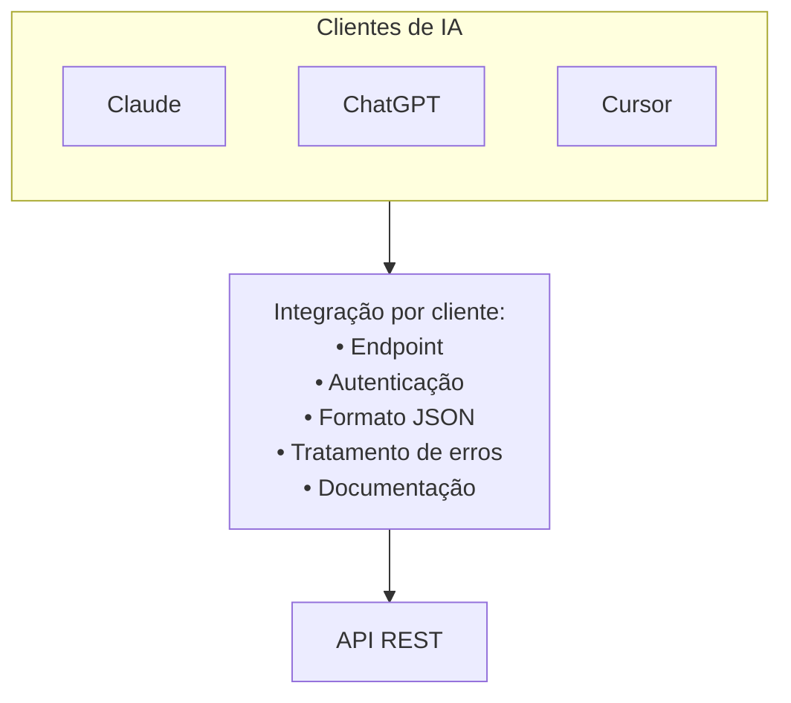
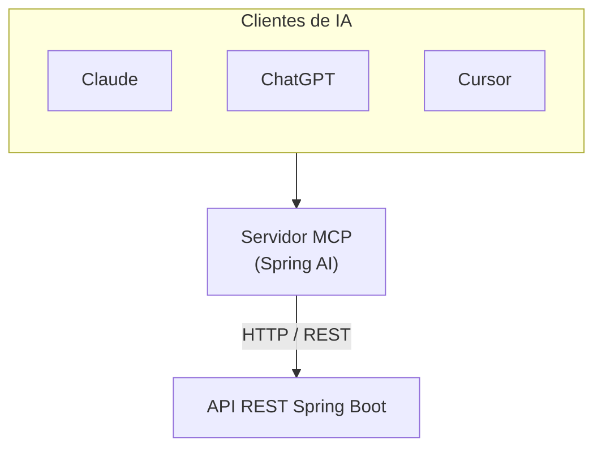
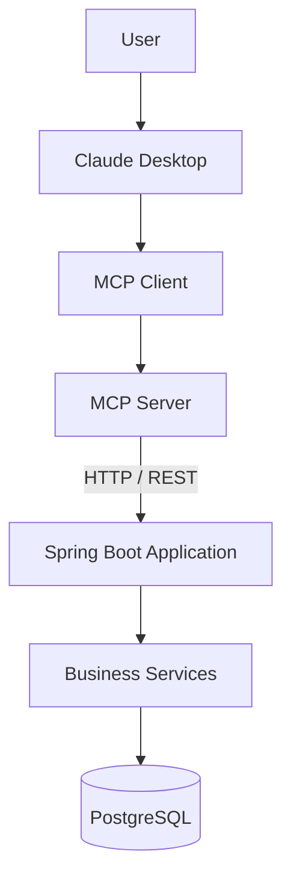

Um LLM já pode chamar sua API REST hoje. O MCP não substitui essa API — ele dá aos clientes de IA uma forma padronizada de **descobrir e invocar** capacidades de negócio como ferramentas.

Este guia mostra como adicionar um adaptador MCP com **Spring AI** mantendo seu serviço Spring Boot existente inalterado.

## O que você constrói

Dois processos:

- **`order-api`** (porta 8080) — sua API REST existente
- **`mcp-server`** (porta 8081) — adaptador MCP Spring AI que chama a API REST via HTTP

As regras de negócio ficam em `OrderService`. O adaptador apenas traduz chamadas de ferramentas em requisições HTTP.

## A API REST

Seu controller continua sendo um endpoint REST Spring Boot normal:

```java
// order-api — OrderController.java
@RestController
@RequestMapping("/orders")
public class OrderController {

    @PostMapping
    public Order create(@RequestBody CreateOrderRequest request) {
        return orderService.create(request);
    }

    @GetMapping("/{id}")
    public Order findById(@PathVariable("id") Long id) {
        return orderService.findById(id);
    }
}
```

Validação, IDs e persistência ficam em `OrderService` — não na camada MCP.

## Sem MCP

Cada cliente de IA precisa de sua própria integração: endpoints, autenticação, formatos de payload, erros e documentação.



REST foi feito para desenvolvedores. Modelos funcionam melhor com ações nomeadas do que com HTTP bruto.

## Com MCP e Spring AI

Exponha **ferramentas** em vez de URLs. O servidor MCP encaminha chamadas de ferramentas para a API REST.



A API REST não muda. O adaptador é um app Spring Boot separado.

## Stack

Três nomes costumam ser confundidos:

- **MCP** — protocolo aberto para descoberta e invocação de ferramentas
- **`spring-ai-starter-mcp-server-webmvc`** — transforma um app Spring Boot em servidor MCP (HTTP/SSE)
- **`@Tool` / `@McpTool`** — anotações Spring AI que marcam métodos Java como ferramentas

### Spring AI 1.0 (este exemplo)

Anote métodos do adaptador com `@Tool`, registre-os com um `ToolCallbackProvider`, e o starter MCP os publica como ferramentas MCP.

### Versões mais recentes do Spring AI

Prefira `@McpTool` e `@McpToolParam` — o starter faz scan sem um bean de registro manual. Veja a [documentação de anotações MCP do Spring AI](https://docs.spring.io/spring-ai/reference/api/mcp/mcp-annotations-server.html).

## Padrão adaptador

Não exponha métodos de `@RestController` diretamente ao MCP.

O adaptador deve:

1. Definir ferramentas semânticas (`create_order`, `find_order`)
2. Chamar a API REST com `RestClient` ou `WebClient`
3. Deixar regras de negócio no serviço original

Mesma ideia do [spring-rest-to-mcp](https://github.com/addozhang/spring-rest-to-mcp) (receitas OpenRewrite para gerar adaptadores a partir de controllers).

### Mapeamento de ferramentas

| Ferramenta MCP | Chamada REST |
|----------|-----------|
| `create_order(customerId, productId, quantity)` | `POST /orders` |
| `find_order(orderId)` | `GET /orders/{id}` |

### Ferramentas MCP

```java
// mcp-server — OrderMcpTools.java
@Component
public class OrderMcpTools {

    private final OrderApiClient orderApiClient;

    @Tool(name = "create_order", description = "Create a new customer order")
    public String createOrder(
            @ToolParam(description = "Customer identifier") long customerId,
            @ToolParam(description = "Product identifier") long productId,
            @ToolParam(description = "Quantity to order") int quantity) {
        Order order = orderApiClient.createOrder(customerId, productId, quantity);
        return "Created order %d with status %s".formatted(order.id(), order.status());
    }

    @Tool(name = "find_order", description = "Find an order by its identifier")
    public String findOrder(@ToolParam(description = "Order identifier") long orderId) {
        Order order = orderApiClient.findOrder(orderId);
        return "Order %d: status=%s".formatted(order.id(), order.status());
    }
}
```

`OrderApiClient` executa `POST /orders` e `GET /orders/{id}` contra o serviço `order-api` inalterado.

### Registro de ferramentas

```java
// mcp-server — McpToolConfiguration.java
@Bean
ToolCallbackProvider orderToolCallbackProvider(OrderMcpTools tools) {
    return MethodToolCallbackProvider.builder().toolObjects(tools).build();
}
```

### Dependência Maven

Adicione apenas ao módulo adaptador — não ao `order-api`:

```xml
<!-- mcp-server/pom.xml -->
<dependency>
    <groupId>org.springframework.ai</groupId>
    <artifactId>spring-ai-starter-mcp-server-webmvc</artifactId>
</dependency>
```

## Executar localmente

Requisitos: Java 17+, Maven 3.9+.

```bash
# Terminal 1 — API REST
cd examples/adapting-spring-boot-rest-to-mcp/order-api
mvn spring-boot:run

# Terminal 2 — adaptador MCP
cd examples/adapting-spring-boot-rest-to-mcp/mcp-server
mvn spring-boot:run
```

Verifique a API REST:

```bash
curl -X POST http://localhost:8080/orders \
  -H "Content-Type: application/json" \
  -d '{"customerId":15,"productId":83,"quantity":5}'

curl http://localhost:8080/orders/1001
```

Esperado: JSON com `"status":"CREATED"`.

Conecte seu cliente MCP (Cursor, Claude Desktop, MCP Inspector) na porta **8081**. Veja a [documentação do servidor MCP Spring AI](https://docs.spring.io/spring-ai/reference/api/mcp/mcp-server-boot-starter-docs.html) para detalhes de transporte.

Código completo: [examples/adapting-spring-boot-rest-to-mcp](https://github.com/farukzahra/blog/tree/main/examples/adapting-spring-boot-rest-to-mcp).

## Outras abordagens

- **Adaptador → REST** (este guia) — sem alterações em API legada; fronteira de rede clara
- **Ferramentas chamam `OrderService` diretamente** — greenfield ou monolito que você controla
- **SDK MCP Python/Node** — adaptador fora da JVM; API REST inalterada
- **Migração OpenRewrite** — muitos controllers; geração automatizada de `@McpTool`

## Fluxo ponta a ponta



O exemplo usa armazenamento em memória para rodar sem Docker. Deploys em produção mantêm a mesma divisão: REST para apps e integrações, MCP para clientes de IA.
