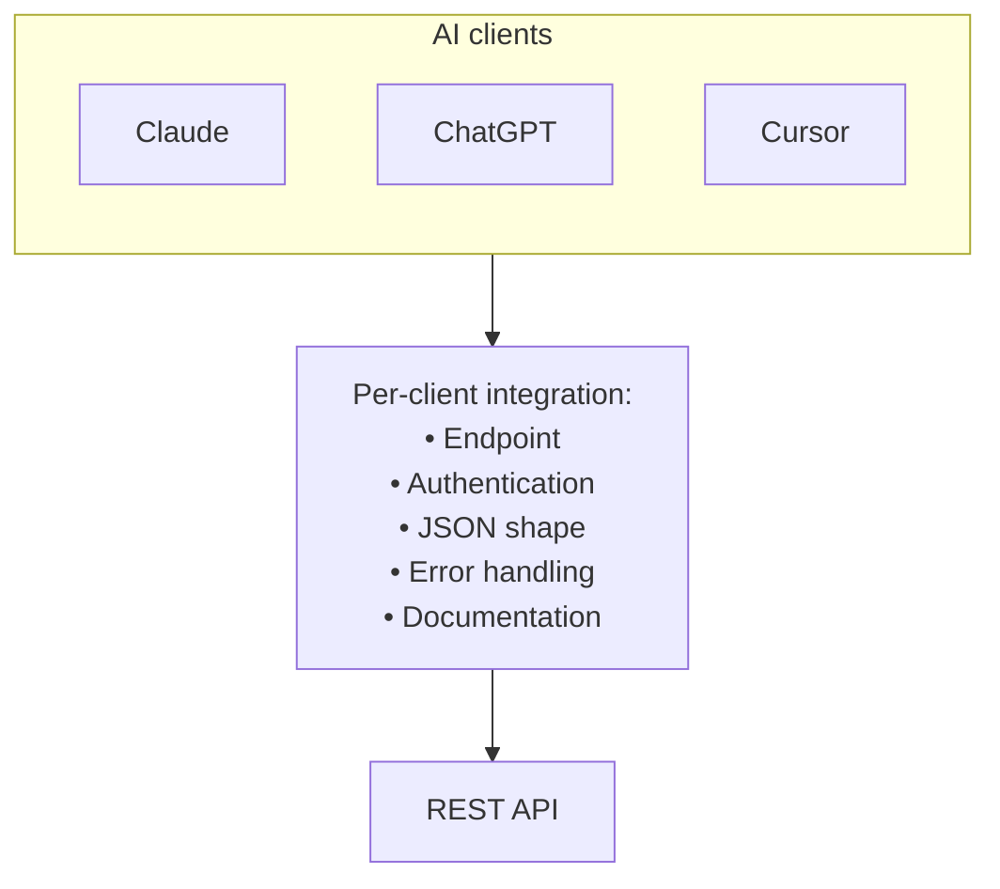
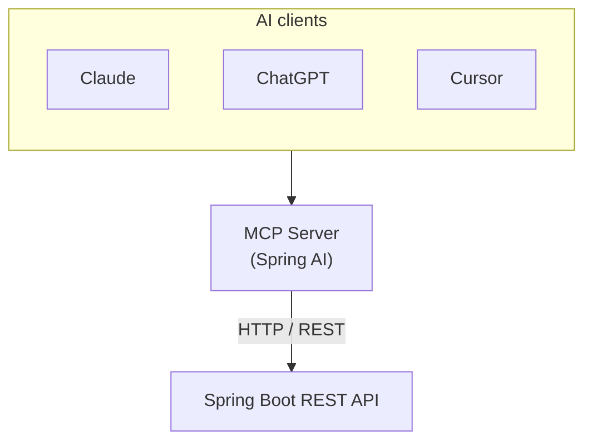
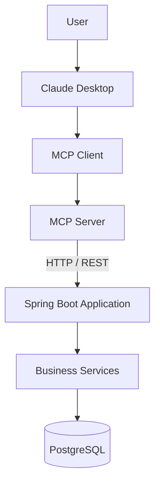

An LLM can call your REST API today. MCP does not replace that API—it gives AI clients a standard way to **discover and invoke** business capabilities as tools.

This guide shows how to add an MCP adapter with **Spring AI** while keeping your existing Spring Boot service unchanged.

## What you build

Two processes:

- **`order-api`** (port 8080) — your existing REST API
- **`mcp-server`** (port 8081) — Spring AI MCP adapter that calls the REST API over HTTP

Business rules stay in `OrderService`. The adapter only translates tool calls into HTTP requests.

## The REST API

Your controller stays a normal Spring Boot REST endpoint:

```java
// order-api — OrderController.java
@RestController
@RequestMapping("/orders")
public class OrderController {

    @PostMapping
    public Order create(@RequestBody CreateOrderRequest request) {
        return orderService.create(request);
    }

    @GetMapping("/{id}")
    public Order findById(@PathVariable("id") Long id) {
        return orderService.findById(id);
    }
}
```

Validation, IDs, and persistence live in `OrderService`—not in the MCP layer.

## Without MCP

Each AI client needs its own integration: endpoints, auth, payload shapes, errors, and docs.



REST is built for developers. Models work better with named actions than raw HTTP.

## With MCP and Spring AI

Expose **tools** instead of URLs. The MCP server forwards tool calls to the REST API.



The REST API does not change. The adapter is a separate Spring Boot app.

## Stack

Three names often get mixed up:

- **MCP** — open protocol for tool discovery and invocation
- **`spring-ai-starter-mcp-server-webmvc`** — turns a Spring Boot app into an MCP server (HTTP/SSE)
- **`@Tool` / `@McpTool`** — Spring AI annotations that mark Java methods as tools

### Spring AI 1.0 (this example)

Annotate adapter methods with `@Tool`, register them with a `ToolCallbackProvider`, and the MCP starter publishes them as MCP tools.

### Newer Spring AI releases

Prefer `@McpTool` and `@McpToolParam`—the starter scans them without a manual registration bean. See the [Spring AI MCP annotations docs](https://docs.spring.io/spring-ai/reference/api/mcp/mcp-annotations-server.html).

## Adapter pattern

Do not expose `@RestController` methods directly to MCP.

The adapter should:

1. Define semantic tools (`create_order`, `find_order`)
2. Call the REST API with `RestClient` or `WebClient`
3. Leave business rules in the original service

Same idea as [spring-rest-to-mcp](https://github.com/addozhang/spring-rest-to-mcp) (OpenRewrite recipes for generating adapters from controllers).

### Tool mapping

| MCP tool | REST call |
|----------|-----------|
| `create_order(customerId, productId, quantity)` | `POST /orders` |
| `find_order(orderId)` | `GET /orders/{id}` |

### MCP tools

```java
// mcp-server — OrderMcpTools.java
@Component
public class OrderMcpTools {

    private final OrderApiClient orderApiClient;

    @Tool(name = "create_order", description = "Create a new customer order")
    public String createOrder(
            @ToolParam(description = "Customer identifier") long customerId,
            @ToolParam(description = "Product identifier") long productId,
            @ToolParam(description = "Quantity to order") int quantity) {
        Order order = orderApiClient.createOrder(customerId, productId, quantity);
        return "Created order %d with status %s".formatted(order.id(), order.status());
    }

    @Tool(name = "find_order", description = "Find an order by its identifier")
    public String findOrder(@ToolParam(description = "Order identifier") long orderId) {
        Order order = orderApiClient.findOrder(orderId);
        return "Order %d: status=%s".formatted(order.id(), order.status());
    }
}
```

`OrderApiClient` performs `POST /orders` and `GET /orders/{id}` against the unchanged `order-api` service.

### Tool registration

```java
// mcp-server — McpToolConfiguration.java
@Bean
ToolCallbackProvider orderToolCallbackProvider(OrderMcpTools tools) {
    return MethodToolCallbackProvider.builder().toolObjects(tools).build();
}
```

### Maven dependency

Add this only to the adapter module—not to `order-api`:

```xml
<!-- mcp-server/pom.xml -->
<dependency>
    <groupId>org.springframework.ai</groupId>
    <artifactId>spring-ai-starter-mcp-server-webmvc</artifactId>
</dependency>
```

## Run locally

Requirements: Java 17+, Maven 3.9+.

```bash
# Terminal 1 — REST API
cd examples/adapting-spring-boot-rest-to-mcp/order-api
mvn spring-boot:run

# Terminal 2 — MCP adapter
cd examples/adapting-spring-boot-rest-to-mcp/mcp-server
mvn spring-boot:run
```

Verify the REST API:

```bash
curl -X POST http://localhost:8080/orders \
  -H "Content-Type: application/json" \
  -d '{"customerId":15,"productId":83,"quantity":5}'

curl http://localhost:8080/orders/1001
```

Expected: JSON with `"status":"CREATED"`.

Connect your MCP client (Cursor, Claude Desktop, MCP Inspector) to port **8081**. See the [Spring AI MCP server docs](https://docs.spring.io/spring-ai/reference/api/mcp/mcp-server-boot-starter-docs.html) for transport details.

Full source: [examples/adapting-spring-boot-rest-to-mcp](https://github.com/farukzahra/blog/tree/main/examples/adapting-spring-boot-rest-to-mcp).

## Other approaches

- **Adapter → REST** (this guide) — no changes to a legacy API; clear network boundary
- **Tools call `OrderService` directly** — greenfield or monolith you control
- **Python/Node MCP SDK** — non-JVM adapter; REST API unchanged
- **OpenRewrite migration** — many controllers; automated `@McpTool` generation

## End-to-end flow



The example uses in-memory storage so you can run it without Docker. Production deployments keep the same split: REST for apps and integrations, MCP for AI clients.
