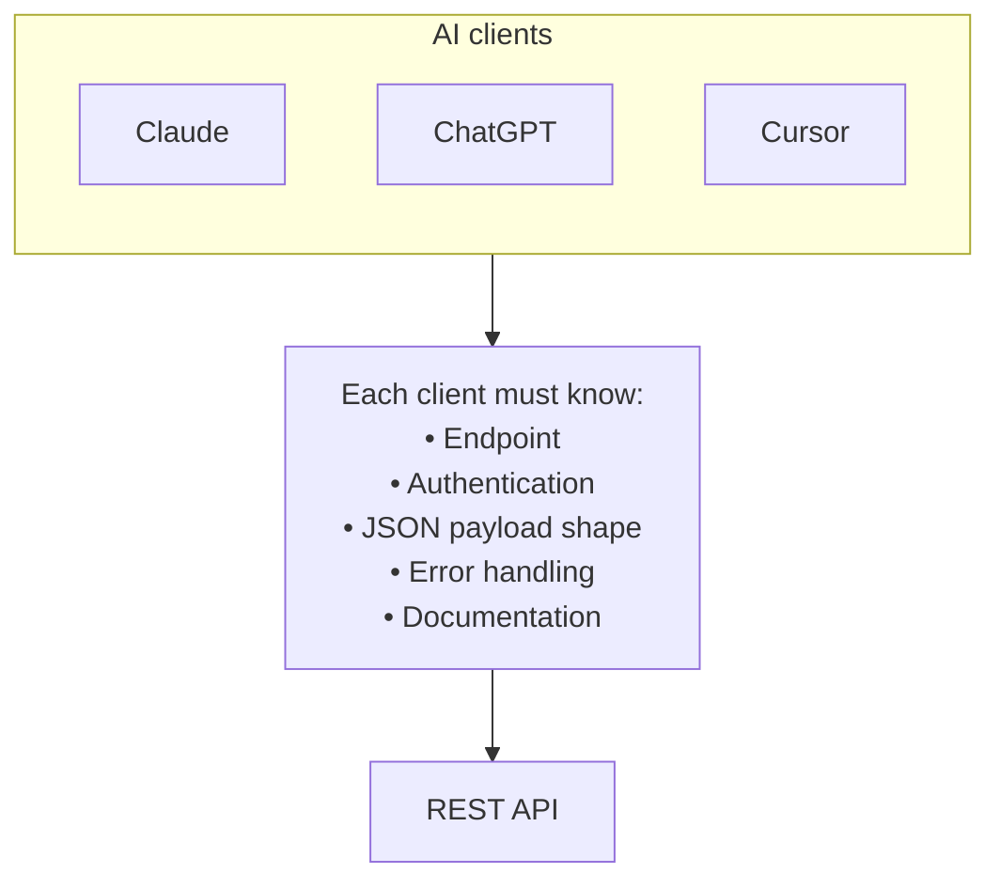
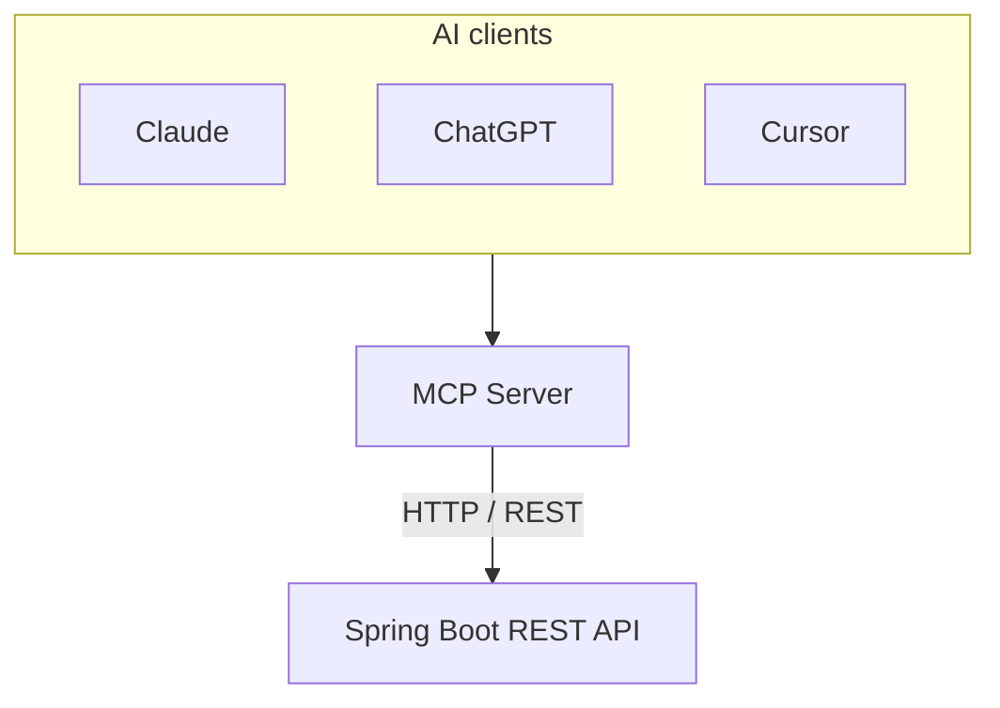
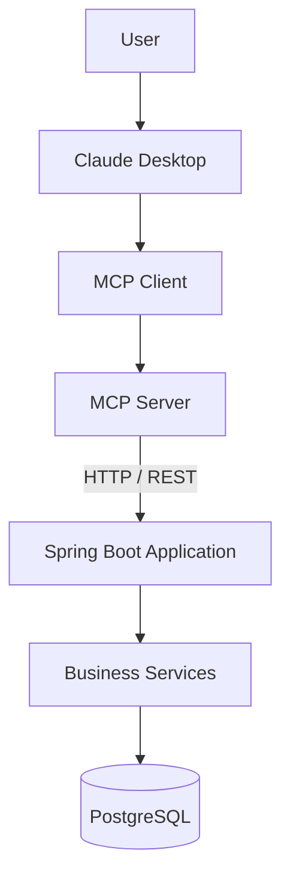

Many Java developers look at MCP (Model Context Protocol) and ask the same question:

> "Why can't my LLM just call my REST API?"

The answer is simple: **it can**.

MCP does not replace REST APIs. Instead, it provides a standard interface that allows AI applications (Claude, ChatGPT, Cursor, VS Code, and others) to **discover and invoke** your existing business capabilities.

Let's see how this works.

## Existing Spring Boot API

Imagine we already have a simple Order API.

```java
@RestController
@RequestMapping("/orders")
public class OrderController {

    @PostMapping
    public Order create(@RequestBody CreateOrderRequest request) {
        return orderService.create(request);
    }

    @GetMapping("/{id}")
    public Order findById(@PathVariable Long id) {
        return orderService.findById(id);
    }
}
```

Nothing special. It is a regular enterprise REST API.

Our business logic lives inside `OrderService`:

```java
@Service
public class OrderService {

    public Order create(CreateOrderRequest request) {
        // business rules, validation, persistence...
    }

    public Order findById(Long id) {
        // ...
    }
}
```

## The traditional integration

Without MCP, every AI application needs its own integration.



The REST API was designed for developers — not for AI models.

## Adding an MCP layer

Instead of exposing REST directly to the model, we expose **tools**.



The REST API remains **unchanged**.

The MCP server translates AI tool calls into REST requests.

## How is this implemented today?

Three pieces are easy to mix up:

- **MCP** — An open protocol (like HTTP, but for AI tools). Clients discover and call tools in a standard way.
- **Spring AI MCP Server** — A Spring Boot starter (`spring-ai-starter-mcp-server-webmvc`) that turns your app into an MCP server over HTTP/SSE.
- **`@Tool` / `@McpTool`** — Spring AI annotations that mark Java methods as tools. They are **not** a separate framework.

In **Spring AI 1.0** (what our example uses), you annotate adapter methods with `@Tool` and register them with a `ToolCallbackProvider`. The MCP starter converts those tools into MCP tool definitions automatically.

In **newer Spring AI releases**, the same idea uses MCP-specific annotations:

```java
@McpTool(name = "create_order", description = "Create a new customer order")
public String createOrder(@McpToolParam(description = "Customer ID") long customerId, ...) {
    // ...
}
```

No manual registration bean is required — the starter scans `@McpTool` methods for you. See the [Spring AI MCP annotations docs](https://docs.spring.io/spring-ai/reference/api/mcp/mcp-annotations-server.html).

### The adapter pattern (REST stays untouched)

The important architectural rule: **do not expose your `@RestController` directly to MCP**.

Instead, create an adapter that:

1. Exposes semantic MCP tools (`create_order`, `find_order`)
2. Calls the existing REST API with `RestClient` (or `WebClient`)
3. Keeps all business rules inside the original Spring Boot service

This is the same pattern described in production write-ups and migration tooling such as [spring-rest-to-mcp](https://github.com/addozhang/spring-rest-to-mcp) (OpenRewrite recipes that help generate MCP adapters from existing controllers).

### Alternative approaches

- **Separate MCP adapter → REST** (this article) — Zero changes to a legacy API; clear network boundary.
- **MCP tools call `OrderService` directly** — Greenfield app or you control the monolith.
- **Python/Node MCP SDK** — Team prefers non-JVM adapter; REST API stays as-is.
- **OpenRewrite migration** — Many controllers to expose; want automated `@McpTool` generation.

## Example tool

Instead of exposing:

```
POST /orders
```

we expose:

```
create_order(customerId, productId, quantity)
```

Internally, the MCP adapter performs exactly the same HTTP request:

```http
POST /orders
Content-Type: application/json

{
  "customerId": 15,
  "productId": 83,
  "quantity": 5
}
```

Your business logic is still executed by the existing Spring Boot application. Nothing changes there.

In our [runnable example](https://github.com/farukzahra/astro/tree/main/examples/adapting-spring-boot-rest-to-mcp), the `mcp-server` module is a small Spring Boot app with the MCP starter. The adapter calls the REST API via `RestClient`:

```java
@Component
public class OrderMcpTools {

    private final OrderApiClient orderApiClient;

    // Spring AI @Tool = this method becomes an MCP tool (via the MCP server starter)
    @Tool(name = "create_order", description = "Create a new customer order")
    public String createOrder(
            @ToolParam(description = "Customer identifier") long customerId,
            @ToolParam(description = "Product identifier") long productId,
            @ToolParam(description = "Quantity to order") int quantity) {
        Order order = orderApiClient.createOrder(customerId, productId, quantity);
        return "Created order %d with status %s".formatted(order.id(), order.status());
    }
}
```

`OrderApiClient` is plain Spring code that does `POST /orders` against the unchanged `order-api` service. A small configuration class registers the tool bean with Spring AI:

```java
@Bean
ToolCallbackProvider orderToolCallbackProvider(OrderMcpTools tools) {
    return MethodToolCallbackProvider.builder().toolObjects(tools).build();
}
```

Maven dependency for the adapter process:

```xml
<dependency>
    <groupId>org.springframework.ai</groupId>
    <artifactId>spring-ai-starter-mcp-server-webmvc</artifactId>
</dependency>
```

The `order-api` module has **no** Spring AI dependency — it remains a normal REST service.

## Why is this useful?

The AI model no longer needs to know:

- URLs
- HTTP verbs
- JSON structures
- authentication flows

It only sees **business capabilities**.

Instead of reasoning about HTTP, it reasons about actions:

- `create_order()`
- `cancel_order()`
- `find_customer()`
- `check_inventory()`

This semantic layer makes tool selection significantly easier for LLMs.

## Architecture



In the example project we use in-memory storage so you can run everything locally without Docker.

## Conclusion

One of the biggest misconceptions about MCP is that it replaces existing APIs.

**It doesn't.**

Your Spring Boot application remains exactly the same. The MCP server acts as an adapter that exposes your business capabilities in a language AI models can understand.

In many enterprise environments, this means existing Java systems can become AI-enabled **without changing a single business rule**.

## Runnable code

Clone the example from GitHub and follow the README:

`examples/adapting-spring-boot-rest-to-mcp`

1. Start `order-api` on port **8080**
2. Start `mcp-server` on port **8081**
3. Connect your MCP client to the adapter

The REST API can keep serving mobile apps, BFFs, and integrations exactly as before — MCP is just another front door.
