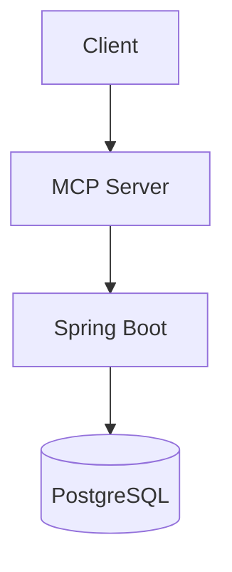

Model Context Protocol (MCP) permite que clientes de IA consumam ferramentas e contexto de forma padronizada.

## Arquitetura



## Fluxo básico

1. Cliente envia request MCP
2. Server roteia para handler Spring
3. Resposta serializada de volta ao cliente

## Exemplo de tool handler

```java
@Component
class WeatherTools {
  @Tool(description = "Get weather by city")
  String weather(String city) {
    return "22°C em " + city;
  }
}
```

## KaTeX (exemplo)

Retrieval score simplificado: $score = \cos(\vec{q}, \vec{d})$

## SQL de referência

```sql
SELECT id, title, embedding
FROM documents
ORDER BY embedding <=> :query
LIMIT 5;
```
